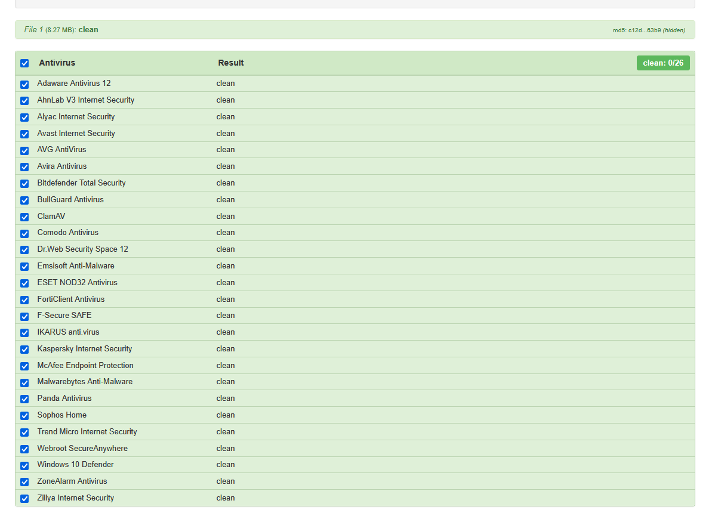
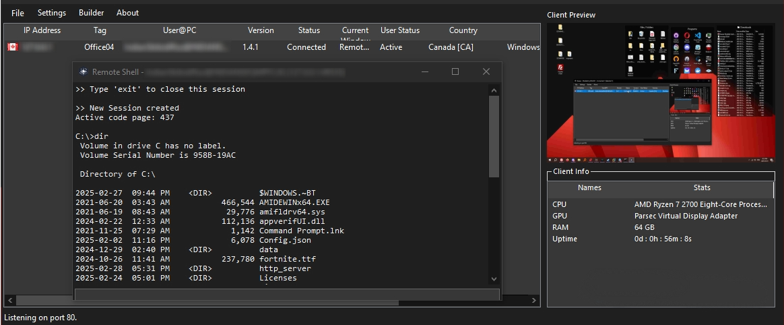
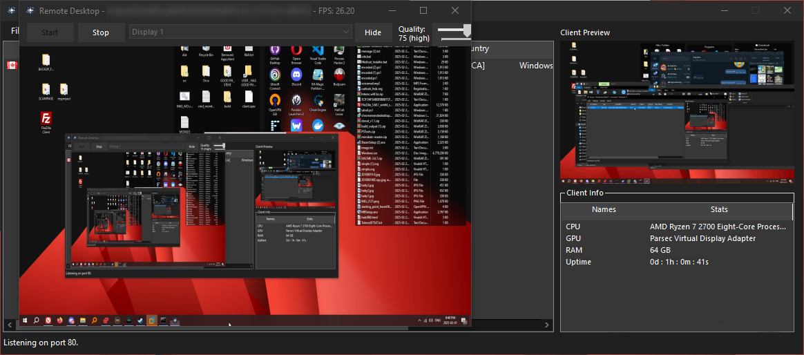
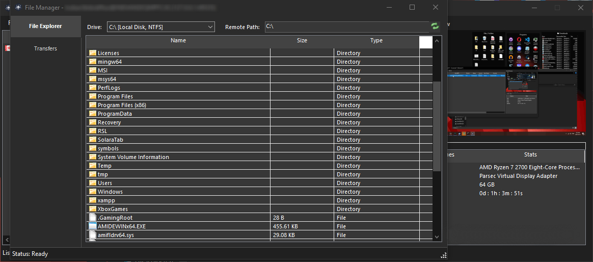

# Quasar [FUD/Crypted]

**Free, Open-Source Remote Administration Tool for Windows**

Quasar is a fast and light-weight remote administration tool coded in C#. The usage ranges from user support through day-to-day administrative work to employee monitoring. Providing high stability and an easy-to-use user interface, Quasar is the perfect remote administration solution for you.

---

## 📥 Download

- **[Latest stable release](https://github.com/0dinHa4kr/Quasar-FUD/releases/)

---

## 📸 Screenshots

### Detections

### Remote Shell

### Remote Desktop

### Remote Files

---

## ✨ Features

- **TCP network stream** (IPv4 & IPv6 support)
- **Fast network serialization** (Protocol Buffers)
- **Encrypted communication** (TLS)
- **UPnP Support** (automatic port forwarding)
- **Task Manager**
- **File Manager**
- **Startup Manager**
- **Remote Desktop**
- **Remote Shell**
- **Remote Execution**
- **System Information**
- **Registry Editor**
- **System Power Commands** (Restart, Shutdown, Standby)
- **Keylogger** (Unicode Support)
- **Reverse Proxy** (SOCKS5)
- **Password Recovery** (Common Browsers and FTP Clients)
- **... and many more!**

## 🖥️ Supported Runtimes and Operating Systems

- **.NET Framework 4.5.2 or higher**
- **Supported operating systems** (32- and 64-bit):
  - Windows 11
  - Windows Server 2022
  - Windows 10
  - Windows Server 2019

OTHER VERSIONS NOT TESTED!
---

## 📜 License

Quasar is distributed under the **[Apache 2.0 License](LICENSE)**.  
Third-party licenses are located [here](Licenses).

---

## 🙏 Thank You!

I really appreciate all kinds of feedback and contributions. Thanks for using and supporting Quasar!
